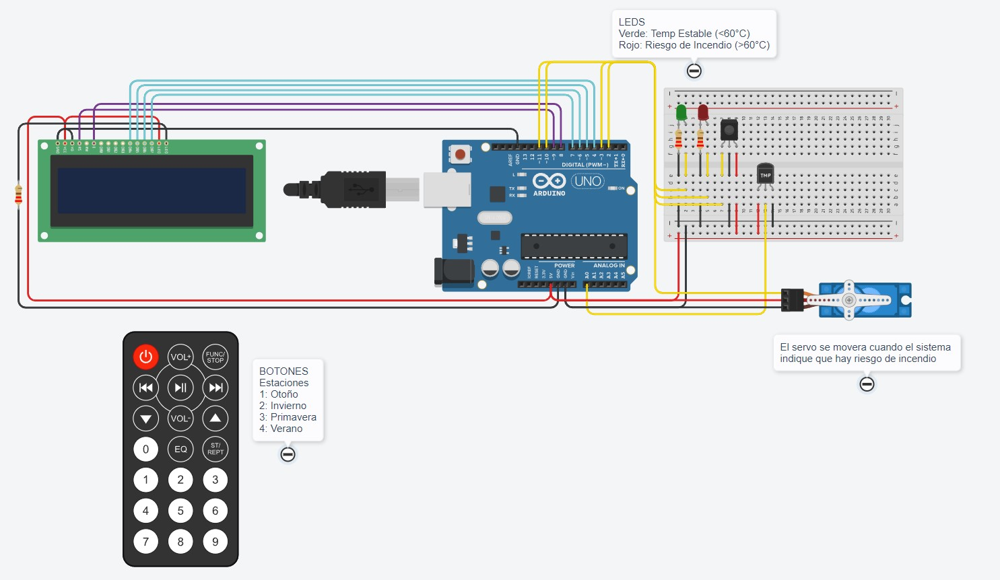
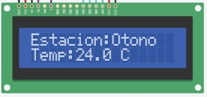
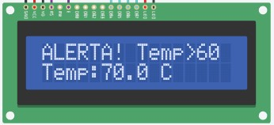
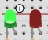
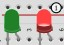
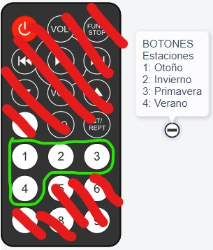

# **Sistema Contra Incendios**

---
## Descripcion

El proyecto se basa en crear, en base a **Arduino**, el funcionamiento de un Sistema Contra Incendios. Este sistema alerta al usuario un peligro de incendio al detectar temperaturas mayores a 60°C. Esto es posible gracias a los siguientes componentes:

- ***Arduino UNO***
- ***LCD 16x2***
- ***Sensor de Temperatura***
- ***Control IR***
- ***2 Leds***
- ***Servomotor***

A continuacion se mostrara una imagen del sistema con los componentes ya mencionados:

---
## Componentes
***Arduino UNO***: Realiza las conexiones de cada componente para su correcto funcionamiento.

***LCD 16x2***: Es el encargado de mostrarle al usuario la **Estacion del Año** en la que se encuentra y la **temperatura** en grados Celsius (°C):

Cuando la **temperatura** sobrepase los 60°C, el LCD mostrara un mensaje de alerta, indicandole al usuario que la **temperatura** esta arriba de los 60°C:

Abajo quedara el medidor, para que el usuario pueda guiarse y tener una idea de la **temperatura** actual.

***Sensor de Temperatura***: Es el que se encarga de medir la **temperatura ambiente**

***Servo***: Se movera de forma remota cuando el sistema indique la **alerta de incendio**, cuando la **temperatura** este estable, dejara de moverse completamente.

***Leds***: El verde indica que la **temperatura** esta estable, cuando salte la **alerta de incendio**, se encendera el led rojo.

**ESTABLE:**

**ALERTA:**

***Control IR***: Se encarga de seleccionar la **Estacion del Año** en la que se encuentra el usuario. Solo con los botones del 1 al 4; el resto de botones no esta configurado:

---
## Funciones Principales

~~~ c++
void controlIR()
{
  if(IrReceiver.decode()){
	valor = IrReceiver.decodedIRData.decodedRawData, HEX; //Devuelve el numero en "Hexadecimal" y lo guarda en "valor"
    
    switch(valor){
      case boton1:
      	lcd.setCursor(9,0);
      	lcd.print("Otono ");
      	break;
      case boton2:
      	lcd.setCursor(9,0);
      	lcd.print("Invier");
      	break;
      case boton3:
      	lcd.setCursor(9,0);
      	lcd.print("Primav");
      	break;
      case boton4:
      	lcd.setCursor(9,0);
      	lcd.print("Verano");
      	break;
    }
    IrReceiver.resume(); //impide que colapse el control al presionar un boton
  }
  delay (300); //tiempo que tarda el control en mandar la señal por cada toque de boton
}
~~~

Realiza el funcionamiento del **Control IR** cuando se toca los botones asignados.

- **IrReceiver.decode()**: Es el que percibe el toque de botones
- **IrReceiver.decodedIRData.decodedRawData**: Lee el valor/data de cada boton que ha tocado el usuario, en este caso se usa *",HEX"* para que la lectura sea en HEXADECIMAL, debido a que la data de los botones en *integers* o *flotantes* son de numeros muy altos y se vuelve inacapaz de guardarlas en una variable para su funcionamiento.
- Luego se lo lleva al *"switch()"* para su funcionamiento dependiendo del boton que es tocado.
- **lcd.setCursor()** sirve para establecer exactamente en que *"fila"* y *"columna"* pisar el LCD 16x2; luego esta el **lcd.print()** para imprimir un mensaje en el LCD 16x2 en el cursor ya seteado.
- **IrReceiver.resume()**: Impide que al tocar un boton, el control no colapse y siga percibiendo el ultimo boton tocado; asi el usuario podra seguir usando el control sin problemas.

---
---

~~~ c++
void temperatura()
{
  lecturaSensor = analogRead(TEMP);
  temp = map(lecturaSensor, 20, 358, -40, 125);
  lcd.setCursor(5,1);
  lcd.print(temp,1);
  
  umbral(); //lo llama para trabajar a la par, ya que esta funcion depende de la temperatura asignada
}
~~~

Realiza la lectura del **Sensor de Temperatura** a traves de un *"analogRead()"* y a su ves, **mapea** los valores del sensor para que se lea en **°C**. Luego llama a la funcion **umbral()** que explicare a continuacion:

---
---

~~~ c++
void umbral()
{
  if(temp > 60){ //se encendera la led roja, el servo se movera y saltara el mensaje de alerta
    lcd.setCursor(0,0);
  	lcd.print("ALERTA! Temp>60");
    servitokun.write(90);
    digitalWrite(ROJO, HIGH);
    digitalWrite(VERDE, LOW);
    delay(300);
  	servitokun.write(0);
    alerta = 1;
  }else{ //se encendera la led verde, el servo NO se movera y el mensaje de alerta desaparecera
    if(alerta == 1 && temp < 60){
      lcd.setCursor(0,0);
  	  lcd.print("                ");
      lcd.setCursor(0,0);
  	  lcd.print("Estacion:Otono ");
      alerta = 0;
    }
    servitokun.write(0);
  	digitalWrite(VERDE, HIGH);
    digitalWrite(ROJO, LOW);
  }
}
~~~

Dependiendo de la **temperatura** asignada, realizara el funcionamiento de las **LEDS**, el **Servo** a traves de la funcion *"servitokun.write()"* y guaradara un 1 a la variable **alerta** cuando se indique el riesgo de incendio. Esta variable es un *"flag"* para indicar el estado del sistema y haci realizar un correcto funcionamiento del LCD 16x2 en los prints.

---
---
---
## Link del Sistema
- [Sistema de Incendios](https://www.tinkercad.com/things/gHk7SRs5Tv3-2do-parcial-barbizan-franco-spd-1b/editel?sharecode=ZTKZ2MeShFURHN2Qqkqk5o7heEg7TjYlp-LU_FjHO2g)